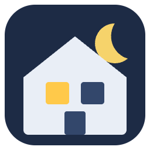

# ioBroker.presence-simulation

**Tests:** 

## Presence Simulation adapter for ioBroker

Makes the house look lived-in while you are away. While the simulation is active, the adapter
replays how your lights, plugs and switches were used a number of days earlier (a week by
default), moving every change by a random few minutes so the pattern is not an exact copy.

The recorded behaviour comes from a history adapter you already run:
[history](https://github.com/ioBroker/ioBroker.history), [influxdb](https://github.com/ioBroker/ioBroker.influxdb)
or [sql](https://github.com/ioBroker/ioBroker.sql). The idea follows the
[Presence Simulation integration for Home Assistant](https://github.com/slashback100/presence_simulation).

Requires Node.js 22 or newer and js-controller 6.0.11 or newer.

## How it works

1. You choose the states to simulate and a history instance that records them.
2. When the simulation starts, the adapter saves each state's current value, then sets each one
   to the value it had at the same moment the chosen number of days earlier.
3. Every 10 minutes it reads the next stretch of history and schedules each recorded change for
   the same time today, shifted by a random offset. Changes to the same state always keep their order.
4. When the simulation stops, the saved values are restored (unless you turn that off).

If ioBroker restarts while the simulation is active, it resumes and still restores the values
saved at the original start. If the automatic start state no longer means "away" when the
adapter comes back (for example you got home while ioBroker was down), a simulation it started
automatically is stopped and the saved values are restored.

The automatic start reacts only to a real change between "away" and anything else. If you switch
the simulation off while you are away, it stays off until you are home and away again, also across
restarts (`info.heldOff` shows this). A state that belongs to another adapter counts when that
adapter confirms it (`ack: true`); your own states under `0_userdata.0` or `javascript.*` count
whenever they are written.

**This adapter writes states that belong to other adapters.** That is its purpose: it switches the
lights and plugs you select, as commands (`ack: false`), in the same way the scenes adapter does.
It only ever writes the states listed in its settings, and only while the simulation is active
(or when restoring them afterwards).

## Before you start: record the states

The simulation can only replay what has been recorded. For every state you want to simulate,
open it in the **Objects** tab, select the wrench icon, and enable logging in your history
instance. The adapter warns in the log about any selected state that is not being recorded.

Replaying 7 days ago needs at least 7 days of recordings.

Notes:

- The replay uses a fixed number of 24-hour days. In the week after a daylight-saving change,
  replayed changes are an hour earlier or later on the clock than the recorded ones.
- On a trip longer than the chosen number of days, the adapter replays its own earlier replay,
  so the random offsets add up a little over time.

## Configuration

| Setting | Description |
|---|---|
| History instance | The history, influxdb or sql instance that records the states. |
| Replay from (days ago) | 1 to 28, default 7. A week repeats your normal weekly routine. |
| Random offset (seconds) | 0 to 1800, default 300. Each change moves up to this much earlier or later. |
| Restore the states when the simulation stops | On by default. |
| States to simulate | Lights, plugs or switches, with an optional name for the log. |
| Start when this state… has this value | Optional. For example a presence state and `AWAY`. The simulation stops when the state changes to any other value. |

## States

| State | Description |
|---|---|
| `active` | Starts (`true`) or stops (`false`) the simulation. Also set by the automatic start. |
| `info.status` | What the adapter is doing. |
| `info.nextAction` | The next scheduled change. |
| `info.lastAction` | The last change made. |
| `info.savedStates` | The values saved at the start, restored when the simulation stops. |
| `info.startedBy` | `trigger` or `manual`: what started the current simulation. |
| `info.heldOff` | `true` after you switched the simulation off while away: it will not start again automatically until you are home and away again. |

## Changelog
<!--
    Placeholder for the next version (at the beginning of the line):
    ### **WORK IN PROGRESS**
-->
### 0.0.2 (2026-10-04)
* (Alan Paris) initial release

## License
MIT License

Copyright (c) 2026 Alan Paris <alan.paris@scottish.rugby>

Permission is hereby granted, free of charge, to any person obtaining a copy
of this software and associated documentation files (the "Software"), to deal
in the Software without restriction, including without limitation the rights
to use, copy, modify, merge, publish, distribute, sublicense, and/or sell
copies of the Software, and to permit persons to whom the Software is
furnished to do so, subject to the following conditions:

The above copyright notice and this permission notice shall be included in all
copies or substantial portions of the Software.

THE SOFTWARE IS PROVIDED "AS IS", WITHOUT WARRANTY OF ANY KIND, EXPRESS OR
IMPLIED, INCLUDING BUT NOT LIMITED TO THE WARRANTIES OF MERCHANTABILITY,
FITNESS FOR A PARTICULAR PURPOSE AND NONINFRINGEMENT. IN NO EVENT SHALL THE
AUTHORS OR COPYRIGHT HOLDERS BE LIABLE FOR ANY CLAIM, DAMAGES OR OTHER
LIABILITY, WHETHER IN AN ACTION OF CONTRACT, TORT OR OTHERWISE, ARISING FROM,
OUT OF OR IN CONNECTION WITH THE SOFTWARE OR THE USE OR OTHER DEALINGS IN THE
SOFTWARE.